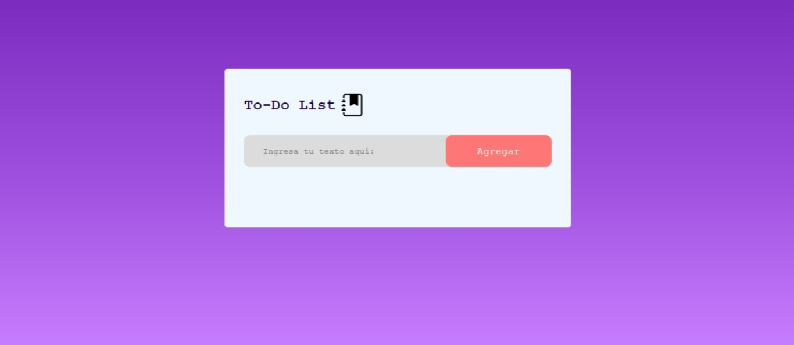
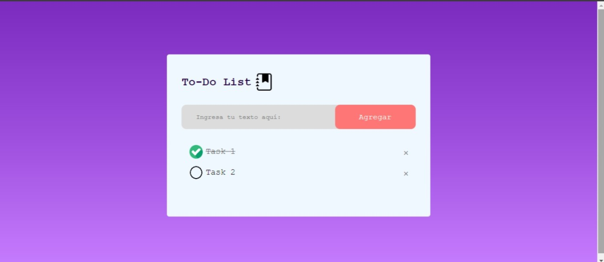

# To-Do List

Una sencilla aplicación de lista de tareas (To-Do List) desarrollada con HTML, CSS y JavaScript. Permite agregar, marcar como completadas y eliminar tareas, además de guardar el estado de la lista en el almacenamiento local del navegador.




## Características

- **Agregar Tareas:** Permite agregar nuevas tareas ingresando texto en el campo de entrada y haciendo clic en el botón "Agregar".
- **Marcar/Desmarcar Tareas:** Las tareas se pueden marcar como completadas o desmarcar haciendo clic en ellas.
- **Eliminar Tareas:** Las tareas se pueden eliminar haciendo clic en el botón de eliminar (representado por una "×").
- **Almacenamiento Local:** Las tareas se guardan en el almacenamiento local del navegador, por lo que se mantendrán al recargar la página.

## Instalación y Uso

1. **Clonar el repositorio:**
   ```bash
   git clone https://github.com/tu-usuario/tu-repositorio.git
   ```

2. **Navegar al directorio del proyecto:**
   ```bash
   cd tu-repositorio
   ```

3. **Abrir el archivo `index.html` en tu navegador:**
   ```bash
   open index.html
   ```
   O simplemente arrastra el archivo `index.html` a una ventana de tu navegador.

## Archivos del Proyecto

- `index.html`: El archivo HTML principal que estructura la aplicación.
- `styles.css`: Archivo CSS que contiene los estilos de la aplicación.
- `script.js`: Archivo JavaScript que maneja la lógica de la aplicación.
- `img/notebook.png`: Imagen del ícono del cuaderno en el encabezado.
- `img/circulo.png`: Imagen del círculo para las tareas no completadas.
- `img/check.png`: Imagen del check para las tareas completadas.

## Capturas de Pantalla

### Vista Principal




## Personalización

Puedes personalizar la aplicación modificando los archivos `styles.css` y `script.js` según tus necesidades. Por ejemplo, puedes cambiar los colores, fuentes o imágenes utilizadas.

## Contribuciones

Las contribuciones son bienvenidas. Si deseas contribuir, por favor sigue los siguientes pasos:

1. Haz un fork del proyecto.
2. Crea una nueva rama (`git checkout -b feature/nueva-funcionalidad`).
3. Realiza tus cambios y haz commit de ellos (`git commit -m 'Agregar nueva funcionalidad'`).
4. Sube tus cambios (`git push origin feature/nueva-funcionalidad`).
5. Abre un Pull Request.


## Contacto

Para cualquier pregunta o sugerencia, puedes contactarme a través de [ndaza@uniempresarial.edu.co](mailto:ndaza@uniempresarial.edu.co).
